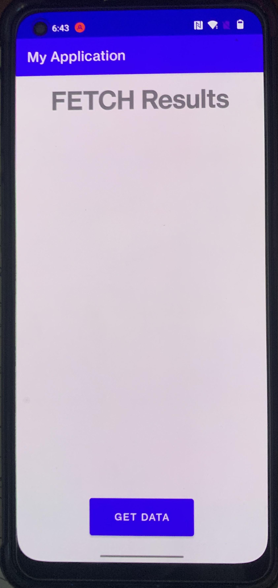
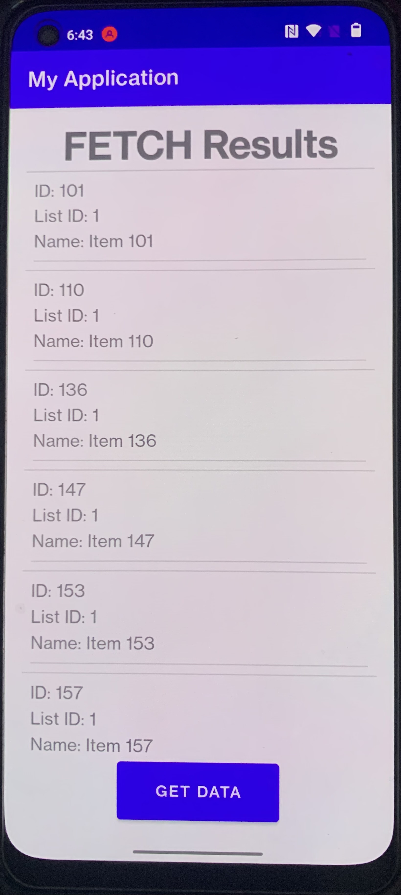
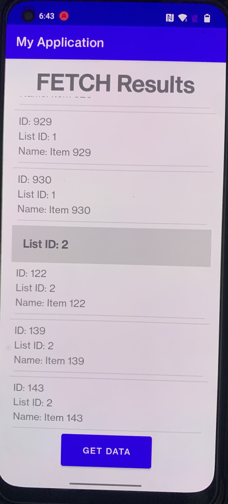

# My Fetch App

My Fetch App is an Android application that fetches data from a remote server, processes it, and displays it in a sorted and grouped manner. The items are grouped by `listId` and sorted first by `listId` and then by `name`. The app uses modern Android components such as `ViewBinding` and `ConstraintLayout`.

## Table of Contents

- [Features](#features)
- [Screenshots](#screenshots)
- [Prerequisites](#prerequisites)
- [Installation](#installation)

## Features

- Fetches data from a remote server.
- Displays items grouped by `listId` and sorted by `listId` and `name`.
- Uses a custom adapter to display headers for each group.
- Utilizes `ViewBinding` for easier view management.

## Screenshots

### Home Screen


### Fetching Data


### Displaying Data


## Prerequisites

Before you begin, ensure you have met the following requirements:

- You have installed the latest version of Android Studio.
- You have a basic understanding of Android development.
- You have an active internet connection for fetching data from the server.

## Installation

1. Clone this repository to your local machine:

    ```sh
    git clone https://github.com/your-username/my-fetch-app.git
    ```

2. Open the project in Android Studio.

3. Build the project to download all the required dependencies.

## Usage

1. Run the application on an Android device or emulator.
2. Click on the "Get Data" button to fetch data from the server.
3. The data will be displayed in a grouped and sorted manner.


